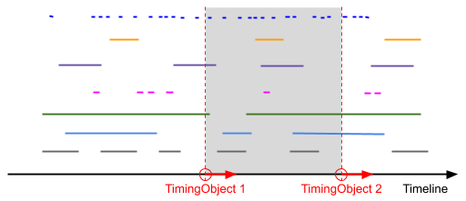

..  _demo-interval-sequencer:

========================================================================
Demo Sequencer Interval Mode
========================================================================

Sequencing timed data using two :ref:`timingobject` (see :ref:`sequencer-intervalmode`). 

- Data elements get activated (red) as their intervals *(start, end)* are overlapping with the interval between the two timing objects. 
- The set of active data elements is visualized just below the position. 
- Skip to a different position by clicking the timeline progress.
- Remove data elements at any time by clicking the appropriate X button. 

.. admonition:: Demo

    .. raw:: html
        :file: ../_demoes/interval_sequencer.html

    `demofile <../_demoes/interval_sequencer.html>`_

Code
------------------------------------------------------------------------

.. literalinclude:: ../_demoes/interval_sequencer.html
    :language: html