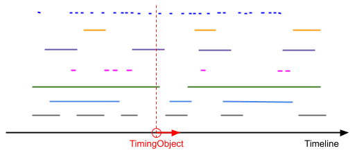

..  _demo-point-sequencer:

========================================================================
Demo Sequencer Point Mode
========================================================================

Sequencing timed data using a single :ref:`timingobject` (see :ref:`sequencer-pointmode`). 

- Data elements get activated (red) as the timingobject comes with their intervals *(start, end)*. 
- The set of active data elements is visualized just below the position. 
- Skip to a different position by clicking the timeline progress.
- Remove data elements at any time by clicking the appropriate X button. 

.. admonition:: Demo

    .. raw:: html
        :file: ../_demoes/point_sequencer.html

    `demofile <../_demoes/point_sequencer.html>`_

Code
------------------------------------------------------------------------

.. literalinclude:: ../_demoes/point_sequencer.html
    :language: html