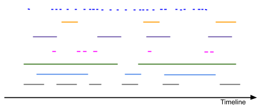

..  _dataset:

========================================================================
Dataset
========================================================================

.. contents::
    :depth: 2

Introduction
------------------------------------------------------------------------

:ref:`dataset` manages a collection of cues, implements the
:ref:`cuecollection` and adds support for flexible and efficient cue
modification and lookup, even for large volumes of cues.
:ref:`Cues <cue>` are simple Javascript objects:

..  code-block:: javascript

    let cue = {
        key: "mykey",
        interval: new Interval(2.2, 4.31),
        data: {...}
    }

Dataset maps *keys* to *cues*, like a ``Map``. In addition, :ref:`cues <cue>`
are also indexed by their positioning on the timeline (see :ref:`interval`), allowing efficient search along the timeline. For instance, the **lookup** method returns all cues within a given lookup interval.

Dataset is useful for management and visualization of large datasets with timed
data, represented as :ref:`cues <cue>`. Typical examples of timed data
include log data, user comments, sensor measurements, subtitles, images,
playlists, transcripts, gps coordinates etc.

Furthermore, the dataset is carefully designed to support
*precisely timed playback* of timed data. This is achieved by connecting
one or more :ref:`Sequencers <sequencer>` to the :ref:`dataset`.

    This illustrates multiple tracks (different colors) of timed data.
    Each colored line segment is a cue, with horizontal placement and length
    indicating cue validity in reference to the timeline.
    Tracks may simply be different types of cues, e.g. comments,
    gps-coordinates, videos, images, audio snippets, etc. A single dataset
    may hold all kinds of cues, collectively defining the state of a
    media presentation, see :ref:`sequencer-mediastate`.

Example
------------------------------------------------------------------------

..  code-block:: javascript

    // create dataset
    let ds = new Dataset();

    // timed data
    let subtitles = [
        {
            id: "1234",
            start: 123.70,
            end: 128.21,
            text: "This is a subtitle"
        },
        ...
    ];

    // create cues from subtitles data
    let cues = subtitles.map(function (sub) {
        let itv = new Interval(sub.start, sub.end);
        return {key: sub.id, interval: itv, data: sub};
    });

    // insert cues
    ds.update(cues);

    // lookup cues
    let result_cues = ds.lookup(new Interval(120, 130));

    // delete cues
    ds.update(cues.map(function(cue) {
        return {key: cue.key};
    });

.. _dataset-update:

Update
------------------------------------------------------------------------

Dataset provides a single operation **update(cues)** allowing cues
to be **inserted**, **modified** and/or **deleted**. The argument
**cues** defines a list of cue arguments (or a single cue argument) to be
**inserted** into the dataset. If a cue with identical key already
exists in the dataset, the *pre-existing* cue will be **modified** to
match the provided cue argument. If a cue argument includes a key but no
interval and no data, this means to **delete** the *pre-existing* cue.

See also special convenience methods build on top of the basic update primitive :ref:`dataset-convenience`.

..  code-block:: javascript

    let ds = new timingsrc.Dataset();

    // insert
    ds.update({
        key: "mykey",
        interval: new timingsrc.Interval(2.2, 4.31),
        data: "foo"
    });

    // modify
    ds.update({
        key: "mykey",
        interval: new timingsrc.Interval(4.4, 6.9),
        data: "bar"
    });

    // delete
    ds.update({key: "mykey"})

When a cue is inserted into the dataset, it will be managed
until it is deleted at some later point. Cue modification is implemented as
*in-place* modification of the *pre-existing* cue. All cue access
operations (e.g. **lookup**) provide direct access to managed cues.

..  warning::

    Cues managed by dataset are considered **immutable** and must
    **never** be modified directly by application code. Always use the
    **update** operation to implement cue modification.

    If managed cue objects are modified by external code, no guarantees
    can be given concerning functional correctness. Note
    also that the dataset does not implement any protection against
    external cue modification.

    The dataset will however throw an exception if a currently managed cue
    object is used as cue argument with the **update** operation.

    Rules of thumb:

    -   always create cue arguments as new object with desired state
    -   never *reuse* previously defined cue objects as arguments to **update**
    -   avoid keeping variables referencing cue objects.

    Unwanted modifications of managed cues may also occur if the *cue.data*
    property is subject to external modification. For instance, it may already be be managed by an application specific data model. If this is the case, one approach would be to copy data objects as part of cue creation. Another approach would be to sequence only references to the data, and then resolving data access directly from the data model, as part of
    cue rendering.

Cue Arguments
""""""""""""""""""""""""""""""""""""""""""""""""""""""""""""""""""""""""

Dataset also supports *partial* cue modification. *Partial*
modification means to modify *only* the *cue interval property* or *only* the *cue data property*. For convenience, partial cue modification allows this to be done without restating the *unmodified* part of the cue. Partial cue
modification is specified simply by omitting the property which is not
to be replaced. The omitted property will then be preserved from the
*pre-existing* cue. This yields four types of legal cue arguments for the
**update** operation:

=====  ========================================  ====================
Type   Cue argument                              Text
=====  ========================================  ====================
A      {key: "mykey"}                            no interval, no data
B      {key: "mykey", interval: ...}             interval, no data
C      {key: "mykey", data: ...}                 no interval, data
D      {key: "mykey", interval: ..., data: ...}  interval, data
=====  ========================================  ====================

..  note::

    Note that ``{key: "mykey"}`` is *type A* whereas ``{key: "mykey",
    data:undefined}`` is type C. The type evaluation is based on
    ``cue.hasOwnProperty("data")`` rather than ``cue.data ===
    undefined``. This ensures that ``undefined`` may be used as a data
    value with cues.

    Similarly, cue intervals may also take the value ``undefined``.
    Without an interval cues become invisible to the **lookup**
    operation, yet still accessible through ``Map`` operations
    **has, get, keys, values, entries**. Otherwise, if cue interval is
    defined, it must be an instance of the ``Interval`` class.

..  note::

    Cue intervals are often derived from timestamps which are also part of
    cue data. This implies that inconsistency may be introduced, if the
    interval is changed, without also changing the associated timestamps
    in the data property -- or the other way around.

    Though not criticial for the integrity of the dataset, such inconsistencies might be confusing for users. For instance if timeline playback does not match timestamps in cue data.

    Rule of thumb:

    -   Avoid cue type B modification if timestamps are part of data.
    -   Similarly, avoid type C modification of timestamps in data, if
        cue intervals are derived from these timestamps.

In summary, the different types of cue arguments are interpreted
according to the following table.

=====  ================================  ===============================
Type   Cue NOT pre-existing              Cue pre-existing
=====  ================================  ===============================
A      NOOP                              DELETE cue
B      INSERT interval, data undefined   MODIFY interval, PRESERVE data
C      INSERT data, interval undefined   MODIFY data, PRESERVE interval
D      INSERT cue                        MODIFY cue
=====  ================================  ===============================

..  _dataset-cue-equality:

Cue Equality
""""""""""""""""""""""""""""""""""""""""""""""""""""""""""""""""""""""""

Cue modification has *no effect* if cue argument is equal to the
*pre-existing* cue. The dataset will detect equality of cue intervals and avoid unneccesary reevaluation of internal indexes.
However, the definition of *object equality* for cue data may be
application dependent. For this reason the **update** operation allows a
custom equality function to be specified using the optional parameter
*equals*. Note that the equality function is evaluated with the cue data
property as arguments, not the entire cue.

..  code-block:: javascript

    function equals(a, b) {
        ...
        return true;
    }

    ds.update(cues, {equals:equals});

The default equality function used by the dataset is the following:

..  code-block:: javascript

    function equals(a, b) {
        // Create arrays of property names
        let aProps = Object.getOwnPropertyNames(a);
        let bProps = Object.getOwnPropertyNames(b);
        let len = aProps.length;
        let propName;
        // If properties lenght is different => not equal
        if (aProps.length != bProps.length) {
            return false;
        }
        for (let i=0; i<len; i++) {
            propName = aProps[i];
            // If property values are not equal => not equal
            if (a[propName] !== b[propName]) {
                return false;
            }
        }
        // equal
        return true;
    }

Given that object equality is appropriately specified, **update** operations may safely be repeated, even if cue data have not changed. For instance,
this might be the case when an online source of timed data is polled repeatedly for updates. Results from polling may then be
forwarded directly to the **update** operation. The return value
will indicate if any actual modifications occured.

.. _dataset-update-result:

Update Result
""""""""""""""""""""""""""""""""""""""""""""""""""""""""""""""""""""""""

The **update** operation returns an array of items describing the effects
for each cue argument. Result items are identical to event arguments
**eArg** defined in :ref:`cuecollection-earg`.

..  code-block:: javascript

    // update result item
    let item = {key: ..., new: {...}, old: {...}}

key
    Unique cue key
old
    Cue *before* modification, or undefined if cue was inserted.
new
    Cue *after* modification, or undefined if cue was deleted.

It is possible with result items where both **item.new** and
**item.old** are undefined. For instance, this will be the case if a cue is
both inserted and deleted as part of a single update operation (see
:ref:`dataset-batch`).

.. _dataset-batch:

Batch Operations
""""""""""""""""""""""""""""""""""""""""""""""""""""""""""""""""""""""""

The **update()** operation is *batch-oriented*, implying that
multiple cue operations can be processed as one atomic operation. A
single batch may include a mix of **insert**, **modify** and **delete**
operations.

..  code-block:: javascript

    let ds = new Dataset();

    let cues = [
        {
            key: "key_1",
            interval: new Interval(2.2, 4.31),
            data: "foo"
        },
        {
            key: "key_2",
            interval: new Interval(4.4, 6.9),
            data: "bar"
        }
    ];

    ds.update(cues);

Batch oriented processing is crucial for the efficiency of the
**update** operation. In particular, the overhead of reevaluating
internal indexes may be paid once for the accumulated effects of the
entire batch, as opposed to once per cue modification.

..  warning::

    Repeated invocation of **update** within a single processing task
    is an **anti-pattern** with respect to performance! Cue operations
    should if possible be aggregated and applied together as a single batch.

    ..  code-block:: javascript

        // cues
        let cues = [...];

        // NO!
        cues.forEach(function(cue)) {
            ds.update(cue);
        }

        // YES!
        ds.update(cues);

..  _dataset-chaining:

Cue Chaining
""""""""""""""""""""""""""""""""""""""""""""""""""""""""""""""""""""""""

It is possible to include several cue arguments concerning the same key
in a single batch to **update**. This is called *chained* cue arguments.
Chained cue arguments will be applied in the given order, and the net effect
in terms of cue state will be equal to the effect of splitting the cue
batch into individual invokations of **update**. Internally,
chained cue arguments are collapsed into a single cue operation with the
same net effect. For instance, if a cue is first inserted and then
deleted within a single batch, the net effect is *no effect*.

Correct handling of chained cue arguments introduces an extra test
within the **update** operation, possibly making it slightly
slower for very large cues batches. If the cue batch is known to *not* include any chained cue arguents, this may be indicated by setting the option
*chaining* to false. The default value
for *chaining* is true.

..  code-block:: javascript

    ds.update(cues, {chaining:false});

..  warning::

    If the *chaining* option is set to false, but the cue batch still
    contains chained cue arguments, this violation will not be detected.
    The consequences are not grave. The *old* value of result items and event arguments will be incorrect for chained cues.

..  _dataset-convenience:

Update Convenience Methods
------------------------------------------------------------------------

The dataset defines a few extra update methods for convencience, implemented on top of the basic update primitive.

Operations on a single cue may use **addCue** for inserting or modifying a cue, and **removeCue** to delete a cue. 

..  code-block:: javascript

    ds.addCue("key_1", new Interval(1,2), data);

    ds.removeCue("key_2");

As noted in :ref:`dataset-batch`, it is not recommended to use these methods repeateadly, say in a `for ... loop`. Instead, an argument builder is available to aid the construction of update batches.

..  code-block:: javascript

    ds.builder
        .addCue("key_1", new Interval(1,2), data)
        .removeCue("key_2")
        .addCue("key_3", new Interval(2,3), data)
        .submit()
        

.. _dataset-lookup:

Lookup
------------------------------------------------------------------------

The operation **lookup(interval, mask)** identifies all cues *matching*
a specific interval on the timeline. The parameter **interval**
specifices the target interval and **mask** defines what interval
relations count as a *match*, see :ref:`interval-match`. Similarly, dataset provides an operation  **lookup_delete(interval, mask)** which deletes all cues matching a given interval. This operation is more efficient
than  **lookup** followed by cue deletion using **update**.

..  _dataset-lookup-endpoints:

Lookup endpoints
""""""""""""""""""""""""""""""""""""""""""""""""""""""""""""""""""""""""

In addition to looking up cues, dataset also supports looking up
:ref:`cue endpoints <interval-endpoint>`. The operation **lookup_endpoints(interval)** identifies all cue endpoints **inside** the given interval, as defined in :ref:`interval-comparison`. The operation returns a list of (endpoint, cue) pairs, where endpoint is the *low* or the *high* endpoint
of the cue interval.

..  code-block:: javascript

    {
        endpoint: [value, high, closed, singular],
        cue: {
            key: "mykey",
            interval: new Interval(...),
            data: {...}
        }
    }

The endpoint property is defined in :ref:`interval-endpoint`.

..  _dataset-events:

Events
------------------------------------------------------------------------

Dataset supports three events **batch**, **change** and **remove**,
as defined in :ref:`cuecollection`.

Cue Ordering
------------------------------------------------------------------------

See :ref:`cuecollection-ordering`.

..  _dataset-performance:

Performance
------------------------------------------------------------------------

The dataset implementation targets high performance with high volumes
of cues. In particular, the efficiency of the **lookup** operation is
important as it is used repeatedly during media playback. The
implementation is therefor optimized with respect to fast
**lookup**, with the implication that internal costs related to indexing
are paid by the **update** operation.

The **lookup** operation depends on a sorted index of cue endpoints, and
sorting is performed as part of the **update** operation. For this
reason, **update** performance is ultimately limited by sorting
performace, i.e. ``Array.sort()``, which is O(NlogN) (see `sorting
complexity`_). Importantly, support for :ref:`batch operations<dataset-batch>`
reduces the sorting overhead by ensuring that sorting is
needed only once for a each batch operation, instead of repeatedly for
every cue argument. The implementation of **lookup** uses binary search
to identify the appropriate cues, yielding O(logN)
performance. The crux of the lookup algorithm is to resolve the cues
which *COVERS* (see :ref:'interval-comparison') the lookup interval in sub linear time.

.. _sorting complexity: https://blog.shovonhasan.com/time-space-complexity-of-array-sort-in-v8/

To indicate the performance metrics of the dataset, some measurements have
been collected for common usage patterns. For this particular test a
standard laptop computer is used (Lenovo ThinkPad T450S, 4 cpu Intel
Core i5-53000 CPU, Ubuntu 18.04). Tests are run with Chrome and Firefox,
with similar results. Though results will vary between systems, these
measurements should at least give a rough indication.

Update performance depends primarily the size of the cue batch, but also
a few other factors. The update operation is more efficient if the
dataset is empty ahead of the operation. Also, since the update
operation depends on sorting internally, it matters if the cues are
mostly sorted or random order.

Tests operate on cue batches of size 100.000 cues, which corresponds to
200.000 cue endpoints. Results are given in milliseconds.

=============  ==========================================================  ===
INSERT         100.000 sorted cues into empty dataset                      278
INSERT         100.000 random cues into empty dataset                      524
INSERT         100.000 sorted cues into dataset with 100.000 cues          334
INSERT         100.000 random cues into dataset with 100.000 cues          580
INSERT         10 cues into dataset with 100.000 cues                        2
LOOKUP         100.000 endpoints in interval from dataset of 100.000 cues   74
LOOKUP         20 endpoints from dataset with 100.000 cues                   1
LOOKUP         50.000 cues in interval from dataset of 100.000 cues         80
LOOKUP         10 cues in interval from dataset of 100.000 cues              1
LOOKUP_DELETE  50.000 cues in interval from dataset with 100.000 cues      100
LOOKUP_DELETE  10 cues in interval from dataset with 100.000 cues            1
DELETE         50.000 random cues from dataset with 100.000 cues           280
DELETE         10 random cues from dataset with 100.000 cues                10
CLEAR          Clear dataset with 100.000 cues                              29
=============  ==========================================================  ===

The results show that the dataset implementation is highly efficient
for **lookup** operations and **update** operations with modest cue
batches, even if the dataset is preloaded with a large volume of cues
(100.000). In addition, (not evident from this table) **update**
behaviour is tested up to 1.000.000 cues and appears to scale well with
sorting costs. However, batch sizes beyond 100.000 are not recommended,
as this would likely hurt the responsiveness of the webpage too much.
To maintain responsiveness it would make sense to divide the batch in
smaller parts and spread them out in time. Use cases requiring loading of
over 100.000 cues might also be rare in practice.

