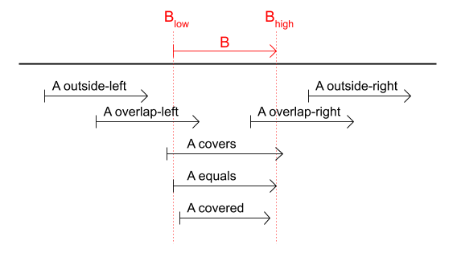

..  _interval:

========================================================================
Interval
========================================================================

``Interval`` is used by ``Axis`` and ``Sequencer`` to define the
validity of objects or values in relation to an *axis*. Intervals
describe either a continuous *line segment* or a singular *point*. In media,
the axis is often thought of as a *timeline* and in this context intervals
define the *temporal validity* of media content.

.. _interval-definition:

Definition
------------------------------------------------------------------------

Following standard mathematical notation intervals are expressed by two
endpoint values **low** and **high**, where **low <= high**. Interval
endpoints are either **open** or **closed**, as indicated with
brackets below:

    e.g.: **[a,b]  [a,b)  (a,b]  (a,b)**

If **low == high** the interval is said to represent a *singular* point
**[low, low]**, or simply **[low]** for short. Endpoints of singular
point intervals are always closed.

*Infinity* values may be used to create un-bounded intervals. Endpoints
with infinite values are always closed.

    e.g.: **[a, Infinity]  [-Infinity, a]  [-Infinity, Infinity]**.

Examples
------------------------------------------------------------------------

How to create intervals.

.. code-block:: javascript

    // [4.0] - singular point
    itv = new Interval(4.0);

    // [4.0] - singular point
    itv = new Interval(4.0, 4.0);

    // [4,6.1) - interval
    itv = new Interval(4.0, 6.1, true, false);

    // (4,6.1) - interval
    itv = new Interval(4.0, 6.1, false, false);

    // [4,6.1] - interval
    itv = new Interval(4.0, 6.1, true, true);

    // (4,6.1] - interval
    itv = new Interval(4.0, 6.1, false, true);

    // [4,6.1) - default endpoints
    itv = new Interval(4.0, 6.1);

    // [4,->] - un-bounded
    itv = new Interval(4.0, Infinity);

..  note::

    Knowledge of how to create intervals is likely sufficient for basic usage
    of ``Axis`` and ``Sequencer``. The rest of this section serves
    mainly as a reference for advanced users interested in the details
    concerning ordering and lookup of intervals on a timeline.

..  _interval-mediastate:

Background
------------------------------------------------------------------------

This focus on intervals and their mathematical definition may seem odd,
given that the topic is media, not mathematics. Still, continuous media
experiences require *media state* to be well defined along its timeline.
For *discrete* media content, points and intervals offer a simple and
elegant mechanism for achieving this goal:

    At any given point **p** on the timeline, the **media state**
    at point **p** is given by the set of all objects with an
    interval covering point **p**.

The mathematical model for points and intervals is attractive in this
context. For example, by using back-to-back intervals **... [a,b),
[b,c), ...** one may ensure that the entire timeline is covered by media
content, and the use of brackets removes any ambiguity regarding the
media state at interval endpoints.

Importantly, the above definition also makes a solid basis for
implementing *navigation* and *playback* within the *media state*. For
example, jumping from one point to another on the timeline requires a quick
transition between two different media states, possibly involving
deactivation of some media objects and activation of others. Furthermore,
during continuous media playback, state transitions must be implemented
dynamically, at the correct time and in the correct order.

.. _interval-endpoint:

Endpoint Types
------------------------------------------------------------------------

Intervals are defined as a pair of interval endpoints. The table
below shows that there are four distinct types of endpoints, and
that endpoints have three distinct properties

*   **value**: numerical value
*   **direction**: left or right
*   **bracket**: closed or open

    ======  ============  ======  =========  =======
    symbol  name          value   direction  bracket
    ======  ============  ======  =========  =======
    **[a**  left-closed   a       left       closed
    **(a**  left-open     a       left       open
    **a]**  right-closed  a       right      closed
    **a)**  right-open    a       right      open
    ======  ============  ======  =========  =======

..  _interval-ordering:

Endpoint Ordering
------------------------------------------------------------------------

Correct ordering of points and endpoints is important for consistency of
media state, media navigation and playback. Ordering is straight forward
as long as endpoint values are different in value. For instance, *2.2]*
is ordered before *(3.1* because *2.2 < 3.1*. However, in case of
equality, sensitivity to properties **bracket** and **direction**
is required to avoid ambiguities.

The internal ordering of point **p** and the four endpoint types
with value **p** is, from left to right:

    **p), [p, p, p], (p**

Or, by name:

    *right-open, left-closed, value, right-closed, left-open*

Based on this ordering we may define the comparison operators **leftof(e1, e2)**
and **rightof(e1, e2)**, where **e1** and **e2** are either endpoints or
regular points values.

    **leftof(e1, e2)** returns true if **e1** is before **e2**,
    and false if **e1** is equal to or after **e2**.

    **rightof(e1, e2)** returns true if **e1** is after **e2**,
    and false if **e1** is equal to or before **e2**.

..  _interval-comparison:

Interval Comparison
------------------------------------------------------------------------

Intervals may overlap partly, fully, or not at all. More formally,
we define interval comparison as follows:

    The operator **cmp(a, b)** compares interval **a** to
    interval **b**. The comparison yields one of seven possible
    relasions: OUTSIDE_LEFT, OVERLAP_LEFT, COVERED, EQUAL, COVERS,
    OVERLAP_RIGHT, or OUTSIDE_RIGHT.

    This illustrates the different interval relations yielded by
    **cmp(a,b)** when seven diffent intervals A are compared to the same
    interval B.

The **cmp(a,b)** operator is then defined in terms of simpler
operators **leftof**, **rightof** and **inside**. The operator
**inside(e, i)** evaluates to true if a point or an endpoint **e** is inside
interval **i**. Interval **i** is in turn defined by its two endpoints
**i.low** and **i.high**.

    **inside(e, i)** = **!leftof(e, i.low) && !rightof(e, i.high)**

Interval relations OUTSIDE_LEFT, OVERLAP_LEFT, COVERED, EQUAL, COVERS,
OVERLAP_RIGHT and OUTSIDE_RIGHT are defined as follows:

+---------------+-----------------------------+-------------------------------------------+
| **cmp(a, b)** | **description**             | **definition**                            |
+---------------+-----------------------------+-------------------------------------------+
| OUTSIDE LEFT  | a is outside b on the left  | - a.high *leftof* b.low                   |
+---------------+-----------------------------+-------------------------------------------+
| OVERLAP LEFT  | a overlaps b from left      | - a.high is *inside* b                    |
|               |                             | - a.low is *leftof* b.low                 |
+---------------+-----------------------------+-------------------------------------------+
| COVERED       | a is covered by b           | - a.low *inside* b && a.high *inside* b   |
|               |                             | - b.low *!inside* a || b.high *!inside* a |
+---------------+-----------------------------+-------------------------------------------+
| EQUAL         | a is equal to a             | - a.low *inside* b && a.high *inside* b   |
|               |                             | - b.low *inside* a && b.high *inside* a   |
+---------------+-----------------------------+-------------------------------------------+
| COVERS        | a covers b                  | - a.low *!inside* b || a.high *!inside* b |
|               |                             | - b.low *inside* a && b.high *inside* a   |
+---------------+-----------------------------+-------------------------------------------+
| OVERLAP RIGHT | a overlaps b from right     | - a.low is *inside* b                     |
|               |                             | - a.high is *rightof* b.high              |
+---------------+-----------------------------+-------------------------------------------+
| OUTSIDE RIGHT | a is outside b on the right | - a.low *rightof* b.high                  |
+---------------+-----------------------------+-------------------------------------------+

Here are a few examples of comparisons between intervals a and b.

======  ======  ===============================================
a       b       cmp(a, b)
======  ======  ===============================================
[2,4>   [4]     OUTSIDE_LEFT: a is outside b on the left
[2,4>   <2,4]   OVERLAP_LEFT: a overlaps b from left
[2,4>   [2,4]   COVERED: a is covered by b
[2,4>   [2,4>   EQUAL: a is equal to b
[2,4>   <2,4>   COVERS: a covers b
[2,4>   <1,3>   OVERLAP_RIGHT: a overlaps b from right
[2,4>   <1,2>   OUTSIDE_RIGHT: a is outside b on the right
======  ======  ===============================================

Api
------------------------------------------------------------------------

Constructor
""""""""""""""""""""""""""""""""""""""""""""""""""""""""""""""""""""""""

..  js:class:: Interval(low[, high[, lowInclude[, highInclude]]])

    :param float low: leftmost endpoint of interval

    :param float high: rightmost endpoint of interval

    :param boolean lowInclude:

        | low endpoint value included in interval
        | true means **left-closed**
        | false means **left-open**
        | true by default

    :param boolean highInclude:

        | high endpoint value included in interval
        | true means **right-closed**
        | false means **right-open**
        | false by default

    If only **low** is given, or if **low == high**, the interval is singular.
    In this case **lowInclude** and **highInclude** are both true.

    If **low** is *-Infinity*, **lowInclude** is always true
    If **high** is *Infinity*, **highInclude** is always true

Instance Attributes
""""""""""""""""""""""""""""""""""""""""""""""""""""""""""""""""""""""""

..  js:attribute:: interval.low

    float: left endpoint value

..  js:attribute:: interval.high

    float: right endpoint value

..  js:attribute:: interval.lowInclude

    boolean: true if interval is left-closed

..  js:attribute:: interval.highInclude

    boolean: true if interval is right-closed

..  js:attribute:: interval.singular

    boolean: true if interval is singular

..  js:attribute:: interval.finite

    boolean: true if both **low** and **high** are finite values

..  js:attribute:: interval.length

    float: interval length (**high-low**)

Instance Methods
""""""""""""""""""""""""""""""""""""""""""""""""""""""""""""""""""""""""

..  js:method:: interval.toString ()

    :returns string:

    Human readable string

..  js:method:: interval.inside(p)

    :param number p: point
    :returns boolean: True if point p is inside interval

    Test if point p is inside interval.

    ..  code-block:: javascript

        let a = new Interval(4, 5)  // [4,5)
        a.inside(4.0)  // true
        a.inside(4.3)  // true
        a.inside(5.0)  // false

..  js:method:: interval.compare(other)

    :param Interval other: interval to compare with
    :returns int: comparison relation

    Compares interval to another interval, i.e. **cmp(interval, other)**.

    ..  code-block:: javascript

        let a = new Interval(4, 5)  // [4,5)
        let b = new Interval(4, 5, true, true)  // [4,5]
        a.compare(b) == Interval.COVERED  // true
        b.compare(a) == Interval.COVERS   // true

Static Attributes
""""""""""""""""""""""""""""""""""""""""""""""""""""""""""""""""""""""""

Interval relations available as static variables on the Interval class.

..  js:attribute:: Interval.OUTSIDE_LEFT
..  js:attribute:: Interval.OVERLAP_LEFT
..  js:attribute:: Interval.COVERED
..  js:attribute:: Interval.EQUAL
..  js:attribute:: Interval.COVERS
..  js:attribute:: Interval.OVERLAP_RIGHT
..  js:attribute:: Interval.OUTSIDE_RIGHT

Static Functions
""""""""""""""""""""""""""""""""""""""""""""""""""""""""""""""""""""""""

..  js:function:: Interval.cmpLow (interval_a, interval_b)

    :param Interval interval_a: interval A
    :param Interval interval_b: interval B
    :returns int:
        | a < b  : -1
        | a == b : 0
        | a > b  : 1

    Use with Array.sort() to sort Intervals by their low endpoint.

    .. code-block:: javascript

        a = [
            new Interval(4,5),
            new Interval(2,3),
            new Interval(1,6)
        ];
        a.sort(Interval.cmpLow);
        // [1,6), [2,3), [4,5)

..  js:function:: Interval.cmpHigh (interval_a, interval_b)

    :param Interval interval_a: interval A
    :param Interval interval_b: interval B
    :returns int:
        | a < b  : -1
        | a == b : 0
        | a > b  : 1

    Use with Array.sort() to sort Intervals by their high endpoint.

    .. code-block:: javascript

        a = [
            new Interval(4,5),
            new Interval(2,3),
            new Interval(1,6)
        ];
        a.sort(Interval.cmpHigh);
        // [2,3), [4,5), [1,6)

