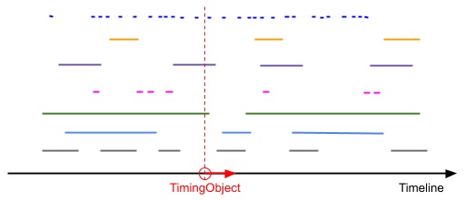
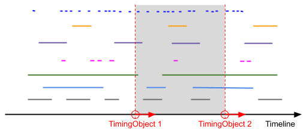

..  _sequencer:

========================================================================
Sequencer
========================================================================

.. contents::
    :depth: 2

Introduction
------------------------------------------------------------------------

The :ref:`sequencer` implements precisely timed *playback* of *timed data*.
Playback is controlled using one or two :ref:`TimingObjects <timingobject>`.
Timed data is represented as :ref:`cues <cue>` managed by a :ref:`dataset`.

.. admonition:: Demo

    :ref:`demo-point-sequencer` sequencing timed data using a single timing object (see :ref:`sequencer-pointmode`). 

    :ref:`demo-interval-sequencer` sequencing timed data using two timing objects (see :ref:`sequencer-intervalmode`). 

    
..  _sequencer-mediastate:

Linear Media State
------------------------------------------------------------------------

Continuous media experiences require *media state* to be well defined
along its timeline. For *discrete* media content, cues tied to points or 
intervals on the timeline is a simple and efficient mechanism for 
achieving this goal:

    At any given point **p** on the timeline, the **media state** at point **p**
    is given by the set of all cues with an interval covering point **p**.

For instance, by using cues with back-to-back intervals **... [a,b), [b,c), ...** 
one may ensure that the entire timeline is covered by media content. The use of
open and closed brackets removes any ambiguity regarding the media state at 
interval endpoints.

Importantly, this definition is also a solid basis for implementing 
*navigation* and *playback* of the *media state*. For example, jumping from one 
point to another on the timeline requires a quick transition between two 
different media states, i.e. deactivation of some cues and activation of others. 
Furthermore, during continuous media playback, cues must be activated and deactivated at 
the correct time and in the correct order. 

The sequencer encapsulates all of this, leaving the programmer to specify appropriate
actions as cues become active and inactive, by implementing handlers for 
sequencer **change** and **remove** events.

Definition
------------------------------------------------------------------------

*   The sequencer implements :ref:`cuecollection` and holds a
    **subset** of the cues managed by its source :ref:`dataset`.

*   At any time, the sequencer holds the particular subset of cues that are
    **active** cues.

*   The sequencer emits **change**, **remove** and **batch** events
    (see: :ref:`cuecollection`) as cues are **activated** or **deactivated**
    during playback.

Active cues
    Cues are **active** or **inactive** based on the playback position, and how it 
    compares to the :ref:`cue interval<cue>`, which defines the **validity** of the 
    cue on the timeline. The sequencer may well be an empty collection, if no cues 
    are **active** at a particular time.

Precisely timed events
    As *playback position* gradually changes during timed playback, cues must be 
    activated or deactivated at the correct time. The sequencer dynamically manipulates 
    its own cue collection and precisely schedules **change** and **remove** events 
    (see: :ref:`cuecollection`) for activation and deactivation of cues.

Flexible timeline navigation and playback
    Sequencers have full support for all kinds of navigation and playback allowed by 
    :ref:`timingobject`. This includes jumping on the timeline, setting the playback 
    velocity, backwards playback and even accelerated playback. For instance, jumping 
    on the timeline might cause all active cues to be deactivated, and a new set of 
    cues to be activated.

Dynamic dataset
    Sequencers support dynamic changes to its source :ref:`dataset`, at any time, 
    also during playback. Cues added to the dataset will be activated immediately 
    if they should be active. Cues removed from the dataset will be deactivated, 
    if they were active. Modified cues will stay active, stay inactive, 
    be activated or be deactived, whichever is appropriate.

Sequence of timed events
    The **change** and **remove** events of the sequencer provide the full 
    storyline (i.e. sequence of transitions) for the set of active cues. 
    This also includes initialization, due to the :ref:`events-init` semantics 
    of the **change** event. The **change** event will initially emit cues that 
    are already active - immediately after the subscription is made. After 
    that, **change** and **remove** events will communicate all subsequent changes, 
    including changes to cue data.

Programming Model
------------------------------------------------------------------------

From the perspective of the programmer, the sequencer is a
**dynamic, read-only view** into a :ref:`dataset` of cues. The view can *always* be trusted to represent the set of active cues correctly, and to communicate all future changes as **change** and **remove** events, at the correct time. This makes for an attractive programming model, where precisely timed playback-visualizations of timed data can be achieved simply by
implementing handlers for sequencer events. In other words, the programmer only 
needs to specify what it means for a cue to become active or inactive.

As such, the sequencer encapsulates all the timing-related complexity, and 
transforms the challenge of *time-driven visualization* into a challenge of 
*data-driven visualization*. Reactive data visualization is already 
a rich domain with mature practices and a broad set of tools and frameworks to 
go with them. So, the sequencer essentially bridges the gap; allowing 
timed visualizations to reap the fruits of modern data visualation tools.

    from data-driven to time-driven visualization

As a trivial example, this demonstrates playback of subtitles in
a Web page (without the need for a video).

..  code-block:: javascript
    :linenos:
    :emphasize-lines: 17, 21-22, 28, 33

    /*
        Simplistic subtitle playback

        const subtitles = [{
            id: "1234",
            start: 123.70,
            end: 128.21,
            text: "This is a subtitle"
        }, ...]
    */

    let ds = new Dataset();
    let to = new TimingObject();
    let activeCues = new Sequencer(ds, to);

    // subtitle DOM element
    let elem = document.getElementById("subtitle");

    // create and load cues
    let cues = subtitles.map(sub => {
        let itv = new Interval(sub.start, sub.end);
        return {key: sub.key, interval: itv, data: sub};
    });
    ds.update(cues);

    activeCues.on("change", function (eArg) {
        // activated subtitle
        elem.innerHTML = eArg.new.data.text;
    });

    activeCues.on("remove", function (eArg) {
        // deactivate subtitle
        elem.innerHTML = "";
    });

    // start playback !
    to.update({velocity:1});

.. note::

    Note how the application-specific part of this example is only a few lines of code (highlighted lines) limited to making cues from specific data format (20-22) and rendering cues (17, 28, 33).

..  _sequencer-modes:

Sequencer Modes
------------------------------------------------------------------------

The sequencer supports two distinct modes of operation, *point mode*
and *interval mode*, with different definitions for **active** cues.

..  _sequencer-pointmode:

Point Mode
""""""""""""""""""""""""""""""""""""""""""""""""""""""""""""""""""""""""

Point mode means that sequencing is based on a *moving sequencing point*.

The sequencer is controlled by a single timing object and uses the *position*
of the timing object as *sequencing point*.

A cue is **active** whenever the *sequencing point* is
**inside** the **cue interval**.

*Point mode* sequencing is the traditional approach for sequencing timed data
based on a media clock.

    The figure illustrates a set of cues and a timing object. The vertical
    dashed line shows the position of the timing object on the timeline.
    Cues that are intersected by this line, one green and one purple,
    are *active*. As the timing object moves to the right, a blue cue
    will soon be activated to, just before the green cue is deactivated.

Initialise a sequencer in point mode by supplying a single timing object.

..  code-block:: javascript

    // dataset
    let ds;
    // timing object
    let to = new TimingObject();
    // point mode sequencer
    let activeCues = new Sequencer(ds, to);

.. admonition:: Demo

    :ref:`demo-point-sequencer` sequencing timed data using a single timing object (see :ref:`sequencer-pointmode`).

..  _sequencer-intervalmode:

Interval Mode
""""""""""""""""""""""""""""""""""""""""""""""""""""""""""""""""""""""""

Interval mode means that sequencing is based on a *moving sequencing interval*.

The sequencer is controlled by two timing objects, and the sequencer uses the 
*positions* of the two timing objects to form the *sequencing interval*.

A cue is **active** whenever at least one point **inside** the 
*sequencing interval* is also **inside** the **cue interval**.

*Interval mode* is useful for playback of sliding windows of timed data.
For instance, interval mode sequencing can be used in conjuction with
point mode sequencing, to prefetch timed data just-in-time for point
mode sequenced rendering.

    The figure illustrates a set of cues and two timing objects. The vertical
    dashed lines shows the positions of the timing objects on the timeline.
    Cues that are visible between these two lines are *active*. In this case,
    the active cues include 2 gray, 2 light-blue, 2 green, 1 pink, 2 purple,
    1 yellow and 12 blue cues. As both timing objects move to the right, the
    first event will be the activation of the blue cue to the right of the
    second timing object.

Initialise a sequencer in interval mode by supplying two timing objects.

..  code-block:: javascript

    // dataset
    let ds;

    // timing object
    let to1 = new TimingObject();

    /*
        skewconverter
        creaate timing object 10.0 ahead of to1
    */
    let to2 = new SkewConverter(to1, 10.0);

    // interval mode sequencer
    let s2 = new Sequencer(ds, to1, to2);

.. admonition:: Demo

    :ref:`demo-interval-sequencer` sequencing timed data using two timing objects (see :ref:`sequencer-intervalmode`). 

Cue ordering
------------------------------------------------------------------------

During playback, if multiple cues share endpoint values, playback
events will also be due at the same time. In this case, cue ordering
is based on :ref:`interval-ordering`. Endpoint ordering is used for
forward movement, or no movement. For backward movement, endpoint ordering is reversed.

Changes in the dataset may also cause events to be emitted for multiple cues
at the same time. For instance, if new cues are inserted into the dataset, some of them might immediately become active. In this case, cue ordering
is still based on :ref:`interval-ordering` and movement direction.
For forward movement or no movement, cues are ordered by
their *low* endpoints. For backward movement, cues are ordered
by their *high* endpoints, and the ordering is reversed.

By default, accessors **keys()**, **values()** and **entries()** do not provide any guarantees with respect to cue ordering.

Events
------------------------------------------------------------------------

Sequencer supports three events **batch**, **change** and **remove**,
as defined in :ref:`cuecollection`.

Cue Ordering
------------------------------------------------------------------------

See :ref:`cuecollection-ordering`.