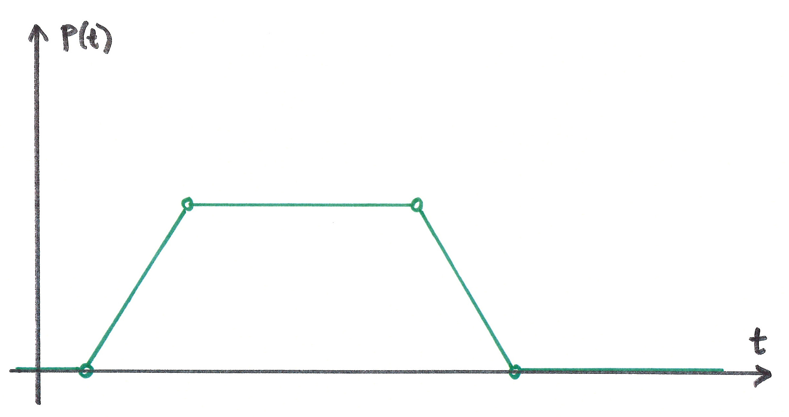
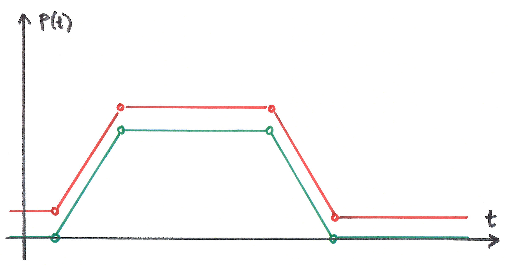
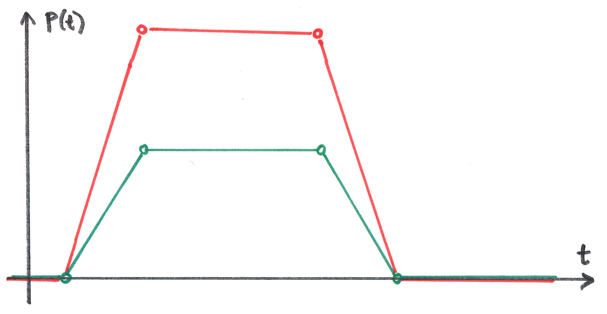
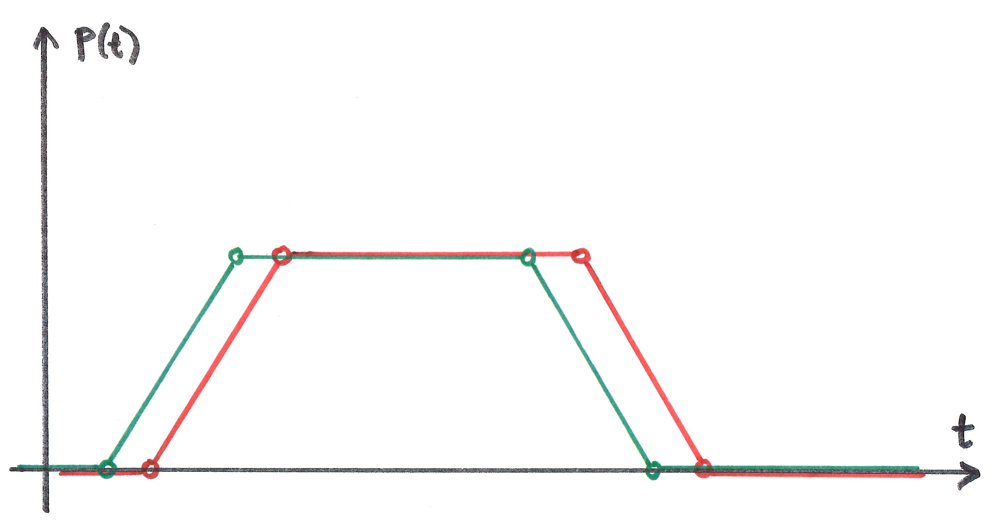
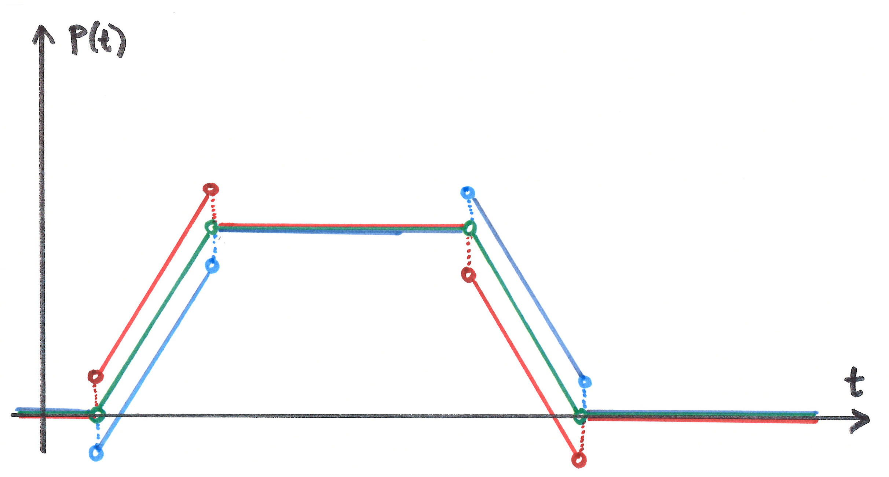
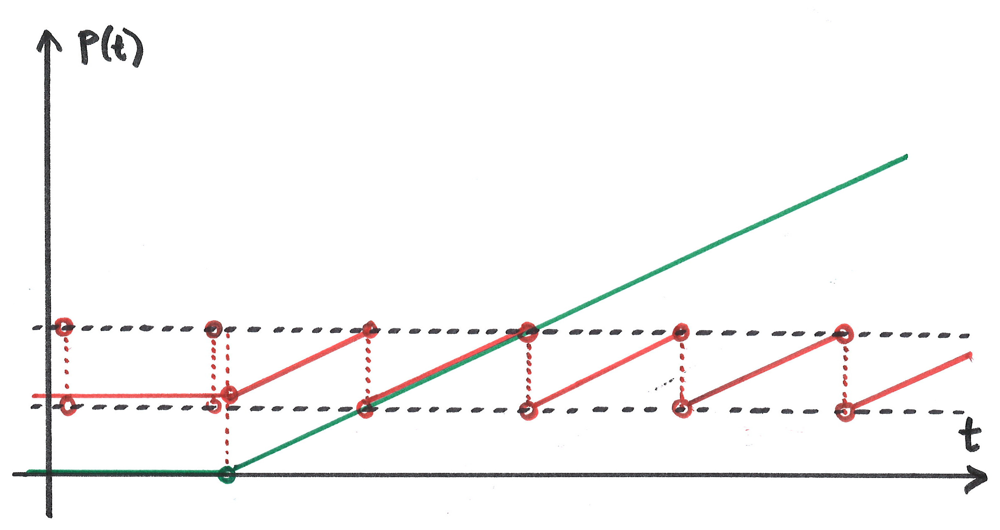

..  _timingconverter:

================================================================================
Timing Converter
================================================================================

.. contents::
    :depth: 2

Introduction
------------------------------------------------------------------------

..  code-block:: html
    :emphasize-lines: 7,10

    <!DOCTYPE html>
    <html>
        <head>
            
        </head>
        <body></body>
    </html>

Timing converters are useful when you need an alternative representation for a :ref:`timingobject`. For example, co-presentation of different media sources might be a problem if said media sources refer to different timelines. Given that the relation between the timelines is known, this can be solved by either of the following approaches.

    1) convert all timestamps of media sources to match the timeline of the timing object
    2) convert a timing object to match the timeline of each media source

The second approach is often most attractive, as converting timestamps in media data may often be inconvenient, costrly or otherwise undesireable. Simply converting the media clock is typically a much easier solution.

.. admonition:: Demo

    See :ref:`demo-timingconverter`

So, as the name suggests, timing converters **convert** timing objects, for instance by *skewing* or *scaling* the timeline of the original timing object.
This may be useful in video playback, where the position of a timing object typically represents media offset in seconds. In this case, a timing converter could be used to create and alternative representation based on frame numbers, with playback velocity set to 24 or 25 frames per second (fps), depending on the media format. Or, for music it might be sensible to use beat number as position, and beats per second (bps) as velocity.

Definition
------------------------------------------------------------------------

A :ref:`timingconverter` provides an alternative representation for a :ref:`timingobject`. 

- a timing converter **is** a timing object, which also depends on a parent timing object. 
- the *timingsrc* property of a Timing Converter identifies its parent timing object.  
- a timing converter implements some modification relative to its *timingsrc*, but never modifies its *timingsrc* in any way.
- multiple timing converters may share *timingsrc*.
- a timing converter can itself be the *timingsrc* of another timing converter.
- a timing converter may forward update requests to the parent, converting the request into the parent timeline if necessary.

So, a chain or hierarchy of timing converters may be created, where all timing converters ultimately depend on a common timing object as root. Each timing converter typically provides a single modification. More complex modifications may for instance be created by combining multiple timing converters. 

Position-time diagrams
------------------------------------------------------------------------

Position-time diagrams are helpful for illustrating the behavior of timing objects and timing converters. In the above figure, the x-axis (horizontal) is time, and the y-axis (vertical) is the position of the timing object. The figure illustrates a sequence of 4 updates to the timing object, where each circle is denoted by a circle. Initially (time 0) the position of the timing object is 0.

1) start the timing object (positive velocity). The position increases linearly.
2) pause the timing object. Position remains unchanged.
3) starts the timing object backwards (negative velocity). Position decreases linearly.
4) pause the timing object at the exact moment when position becomes 0. (This may for instance be enforced by the timing object itself, as a range restriction.)

..  _timingconverter-skew:

Skew Converter
------------------------------------------------------------------------

The effect of the skew converter is illustrated with red coloring. A positive skew is supplied, shifting all positions in the positive direction.

..  _timingconverter-scale:

Scale Converter
------------------------------------------------------------------------

Scaling the by a factor means that all values (position, velocity and acceleration) are multiplied by that factor. 

For example, a factor 1000 scales values in seconds to values in milliseconds. Velocity 1s/s becomes velocity 1000ms/s. 

..  _timingconverter-delay:

Delay Converter
------------------------------------------------------------------------

Delay converter re-plays the behaviour of the timing object, with a fixed delay. Update events are delayed too. Delay converters are read-only in the sence that they do not accept update requests.

..  _timingconverter-timeshift:

Timeshift Converter
------------------------------------------------------------------------

Timeshift converter timeshifts the behavior of the timing object. Red color is ahead in time (speculative). Blue color is after in time. When the position is static, time-shifting has no effect. The Timeshift converter does not timeshift update events.  

.. 
    ..  _timingconverter-range:

    Range Converter
    ------------------------------------------------------------------------

    ..  image:: ../images/rangeconvert.jpg
        :width: 400

    The two dotted black lines illustrate a range restriction for the range converter. The range converter will be equal to the timing object, whenever the timing object is within this range. If the timing object is outside, the timing converter will assume the position closest to the timing object. Range converter generates its own update events.

..  _timingconverter-loop:

Loop Converter
------------------------------------------------------------------------

The two dotted black lines illustrate a range restriction for the loop converter. When the timing object is inside this range, the loop converter will be equal to the timing object. When the timing object is outside, its position is translated to a value within the range, i.e. modulo of range length. 

